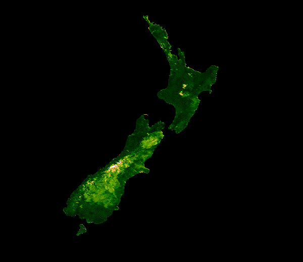

This code masks the globe save New Zealand then runs an NDVI over N.Z. using historical data. NDVI, normalized difference vegetation index, shows vegetation density 
varying across the year with the seasons.
The colors on parts of the islands shift from tan to green across the year in an undulating pattern. The hardest part of writing this code was defining the geometry of the country. I got unstuck from Shadrock's video. After that I was able to use GEE to define a polygon around New Zealand. Then I had to define the region in the visualization parameters, and for ease I made the earlier geometry into a variable with ``var x``. It was a challenging but satisfying assignment.

